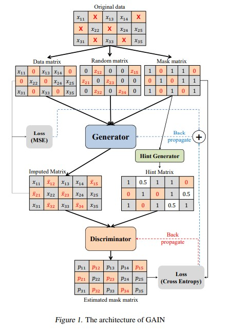

```{r setup, include=FALSE}
knitr::opts_chunk$set(echo = TRUE)
```


```{r load packages, message=FALSE, warning=FALSE, results='hide', echo=FALSE}
rm(list = ls())


library(reticulate)
library(tidyverse)
library(readr)
library(keras)
library(tcltk)
library(tensorflow)
library(dplyr)
library(MASS)
library(holodeck)
library(purrr)
library(mice)


```

```{r, message=FALSE, warning=FALSE, results='hide', echo=FALSE}
reticulate::use_condaenv("tf-env", required = T)
```


# Introduction

Missing data is a pervasive challenge in data analysis, often leading to biased estimates and reduced statistical power when handled improperly. Traditional methods such as mean imputation or multiple imputation (e.g., via the `mice` package) can fall short in capturing complex data distributions especially with high dimensional data.

Generative Adversarial Networks (GANs), introduced by Goodfellow et al. [@NIPS2014_5ca3e9b1], is made up of two neural networks, a **generator** and a **discriminator**, which compete against each other in a minimax game. In the standard GAN framework, the generator creates synthetic data samples from random noise, while the discriminator aims to distinguish between real and generated data. The discriminator maximizes the probability of correctly classifying real and fake inputs where the output is a probability that quantifies how likely it is that the given input is real.

**Generative Adversarial Imputation Nets (GAIN)** [@yoonGAINMissingData2018] extends this framework to the realm of data imputation. Instead of generating entirely new data, GAIN focuses on predicting missing entries in partially observed datasets. The generator in GAIN imputes missing values conditioned on the observed data, while the discriminator is tasked with distinguishing between observed and imputed (i.e., generated) values. This setup is further enhanced by the introduction of a *hint mechanism*, which provides additional information to the discriminator about the missingness pattern, ensuring a more robust imputation process.

A key aspect of GAIN is its loss functions, where the discriminator loss is defined as:

$$
\mathcal{L}_D = -\mathbb{E}_{\mathbf{X}, \mathbf{M}} \Big[ \mathbf{M} \odot \log D(\hat{\mathbf{X}}) + (1-\mathbf{M}) \odot \log \big(1-D(\hat{\mathbf{X}})\big) \Big],
$$

while the generator loss combines the adversarial component with a reconstruction term:

$$
\mathcal{L}_G = -\mathbb{E}_{\mathbf{X}, \mathbf{M}} \Big[ (1-\mathbf{M}) \odot \log D(\hat{\mathbf{X}}) \Big] + \alpha\,\mathcal{L}_{\text{recon}}.
$$


\\
*Figure 1* [@yoonGAINMissingData2018] illustrates the architecture of GAIN, showing how the generator and discriminator interact with the data and the hint matrix.


In this report, we compare the R implementation of GAIN with the performance of the original GAIN implementation (Yoon et al. [@yoonGAINMissingData2018]) and lastly compare its performance with the `mice` package. The aim is to provide a comprehensive understanding of how GAIN functions and its potential advantages for imputation tasks.

## RGAIN and GAIN comparison

```{r, echo=FALSE, warning=FALSE, message=FALSE}
# This function generates a mask for introducing missing values into a dataset.
# Parameters:
# - p: Probability of a value being missing.
# - no: Number of rows in the generated matrix.
# - dim: Number of columns in the generated matrix.
missig <- function(p, no, dim) {
  # Create a matrix of random numbers between 0 and 1 with specified dimensions.
  unif_matrix <- matrix(runif(no * dim), no, dim)
  # Generate a mask where values are 1 with probability 'p', otherwise NA.
  mask <- ifelse((unif_matrix < p), 1, NA)
  return(mask)
}

# This function creates a mask identifying missing values in a dataset.
# Parameters:
# - data: Input dataset (matrix or dataframe).
# Returns:
# - A mask matrix where NA represents missing values and 1 represents observed values.
find_mask <- function(data) {
  mask <- ifelse(is.na(data), NA, 1)
  return(mask)
}

# This function calculates the minimum and maximum values of each column in a dataset.
# Used to generate parameters for normalizing the data.
# Parameters:
# - data: Input matrix or dataframe.
parameters_norm <- function(data) {
  # Calculate the minimum of each column, ignoring NA values.
  min <- apply(data, 2, function(x) min(x, na.rm = TRUE))
  # Calculate the maximum of each column, ignoring NA values.
  max <- apply(data, 2, function(x) max(x, na.rm = TRUE))
  
  # Combine minimum and maximum values into a matrix with two columns.
  parameters <- cbind(min, max)
  return(parameters)
}

# This function normalizes the data using min-max normalization.
# Parameters:
# - data: Input matrix or dataframe to be normalized.
# - parameters: Matrix with min and max values for each column (from parameters_norm).
normalization <- function(data, parameters) {
  # Subtract the minimum value from each element (column-wise).
  data_norm <- sweep(data, 2, parameters[, 1], "-")
  # Divide by the range (maximum - minimum) for each column.
  data_norm <- sweep(data_norm, 2, parameters[, 2], "/")
  
  return(data_norm)
}

# This function renormalizes the data, converting normalized values back to their original scale.
# Parameters:
# - data: Normalized data matrix or dataframe.
# - parameters: Matrix with min and max values for each column (from parameters_norm).
renormalization <- function(data, parameters) {
  # Multiply normalized values by the range (column-wise).
  data_renorm <- sweep(data, 2, parameters[, 2], "*")
  # Add the minimum value to each element (column-wise).
  data_renorm <- sweep(data_renorm, 2, parameters[, 1], "+")
  
  return(data_renorm)
}

# This function calculates the RMSE between the original
# data and imputed data, focusing only on the missing values.
# Parameters:
# - ori_data: Original dataset (with no missing values).
# - imputed_data: Dataset after imputation of missing values.
# - data_m: Mask matrix indicating missing values (1 for observed, NA for missing).
rmse_loss <- function(ori_data, imputed_data, data_m) {
  # Normalize the original and imputed datasets.
  parameters <- parameters_norm(ori_data)
  ori_data <- normalization(ori_data, parameters)
  imputed_data <- normalization(imputed_data, parameters)
  
  # Replace NA values in the mask with 0.
  data_m <- as.data.frame(data_m) %>% 
    mutate(across(everything(), ~replace_na(., 0)))
  
  # Calculate the squared differences, focusing only on missing entries.
  nominator <- sum(((1 - data_m) * ori_data - (1 - data_m) * imputed_data)**2)
  denominator <- sum(1 - data_m)  # Number of missing values.
  
  # Compute the RMSE value.
  rmse <- sqrt(nominator / denominator)
  
  return(rmse)
}

# This function generates a "hint matrix," typically used in data imputation algorithms.
# The matrix is binary, indicating whether a value is included in the hint.
# Parameters:
# - hint_rate: Probability of including a value in the hint.
# - no: Number of rows in the generated matrix.
# - dim: Number of columns in the generated matrix.
hint_matrix <- function(hint_rate, no, dim) {
  # Create a probability matrix of random numbers between 0 and 1.
  prob_matrix <- matrix(runif(no * dim), no, dim)
  # Generate a binary hint matrix based on the hint rate.
  hint <- ifelse((prob_matrix < hint_rate), 1, 0)
  return(hint)
}

# This function rounds imputed data for columns with fewer than 20 unique values.
# This is useful for categorical data that may have been normalized.
# Parameters:
# - imp_data: Imputed dataset.
# - or_data: Original dataset (to check the number of unique values in each column).
rounding <- function(imp_data, or_data) {
  for (i in 1:ncol(or_data)) {
    # Check if the column has fewer than 20 unique values.
    if (length(unique(or_data[, i])) < 20) {
      # Round the values in the imputed dataset for this column.
      imp_data[, i] <- round(imp_data[, i])
    }
  }
  return(imp_data)
}

```

```{r gain, echo=FALSE, warning=FALSE, message=FALSE}
# Function to perform data imputation using the GAIN algorithm
gain <- function(data, 
                 batch_size,  # Number of samples per training batch
                 hint_rate,   # Probability of hint matrix values being revealed
                 alpha,       # Weighting factor for generator loss
                 iterations,  # Number of training iterations
                 learning,    # Learning rate for optimization
                 loss_monitoring,  # Enable or disable loss tracking during training
                 beta_1,      # Beta1 parameter for Adam optimizer
                 beta_2,      # Beta2 parameter for Adam optimizer
                 initialization, # Method for weight initialization (e.g., Xavier, Glorot)
                 progress_bar) {  # Enable or disable a progress bar
  
  # Define the loss function for the discriminator (D)
  D_loss <- function(y_true, y_pred) {
    M <- y_true[[1]]  # True mask matrix
    # Compute the discriminator loss using binary cross-entropy
    loss <- -k_mean(M * k_log(y_pred + 1e-8) + (1 - M) * k_log(1 - y_pred + 1e-8))
    return(loss)
  }

  # Define the loss function for the generator (G)
  # This consists of two parts:
  # - G_loss_temp: Encourages fooling the discriminator for missing values.
  # - MSE_loss: Enforces data consistency for observed values.
  G_loss <- function(y_true, y_pred) {
    M <- y_true[[1]]  # Mask matrix
    D_prob <- y_true[[2]]  # Output probabilities from the discriminator
    G_sample <- y_pred  # Generated data sample
    
    # Loss term for fooling the discriminator
    G_loss_temp <- -k_mean((1 - M) * k_log(D_prob + 1e-8))
    # Mean squared error (MSE) for observed data
    MSE_loss <- k_mean((M * X_mb - M * y_pred)^2) / k_mean(M)
    # Total generator loss
    G_loss <- G_loss_temp + alpha * MSE_loss
    return(G_loss)
  }
  
  # Generate the mask matrix indicating observed (1) and missing (0) values
  data_m <- 1 - is.na(data)
  
  # Store the dimensions of the data
  no <- nrow(data)
  dim <- ncol(data)
  
  # Normalize the data using min-max normalization
  norm_parameters <- parameters_norm(data)
  norm_data <- normalization(data, norm_parameters) %>% 
    mutate(across(everything(), ~replace_na(., 0)))  # Replace NA with 0
  
  # Define the input layers for the GAN
  X <- layer_input(shape = c(dim))  # Data vector (input)
  M <- layer_input(shape = c(dim))  # Mask vector (observed/missing indicator)
  H <- layer_input(shape = c(dim))  # Hint vector (used to train discriminator)
  
  # Define the discriminator architecture
  inputs_D <- layer_concatenate(list(X, H))  # Combine data and hint vector
  
  # Initialize weights using the chosen method
  initializer <- switch(initialization,
                      "Xavier" = initializer_he_normal(),
                      "Glorot" = initializer_glorot_normal(),
                      "Random" = initializer_random_normal(),
                      stop("Invalid initialization method"))

  # Build the discriminator network
  D_output <- inputs_D %>%
    layer_dense(units = dim, activation = "relu",
                kernel_initializer = initializer) %>%
    layer_dense(units = dim, activation = "relu",
                kernel_initializer = initializer) %>%
    layer_dense(units = dim, activation = "sigmoid",  # Sigmoid for binary output
                kernel_initializer = initializer)
  
  # Define the generator architecture
  inputs_G <- layer_concatenate(list(X, M))  # Combine data and mask vector
  
  # Build the generator network
  G_output <- inputs_G %>%
    layer_dense(units = dim, activation = "relu",
                kernel_initializer = initializer) %>%
    layer_dense(units = dim, activation = "relu",
                kernel_initializer = initializer) %>%
    layer_dense(units = dim, activation = "sigmoid",  # Sigmoid for normalized output
                kernel_initializer = initializer)
  
   # Create the discriminator and generator models
  discriminator <- keras_model(inputs = list(X, H), outputs = D_output)
  generator <- keras_model(inputs = list(X, M), outputs = G_output)
  
  # Compile the models with their respective loss functions
  discriminator %>% compile(optimizer = optimizer_adam(learning_rate = learning), loss = D_loss)
  generator %>% compile(optimizer = optimizer_adam(learning_rate = learning), loss = G_loss)
  
  # Initialize a progress bar for training
  if (progress_bar) pb <- tkProgressBar(title = "Progress", min = 0, max = iterations, width = 300)


  # See below
   D_loss_values <- c()
   G_loss_values <- c()

  
    
  # Training loop for the GAN
  for (i in 1:iterations) {
    # Sample a batch of data
    batch_idx <- sample(1:no, batch_size)
    X_mb <- as.matrix(norm_data[batch_idx, ])  # Batch of normalized data
    M_mb <- data_m[batch_idx, ]  # Corresponding mask for the batch
    
    # Generate random noise and hint matrix for the batch
    Z_mb <- runif(batch_size * dim, min = 0, max = 0.01) %>% matrix(nrow = batch_size, ncol = dim)
    H_mb_temp <- hint_matrix(hint_rate, batch_size, dim)
    H_mb <- M_mb * H_mb_temp  + 0.5*(1 - H_mb_temp)
    
    # Combine observed data with random noise for missing values
    X_mb <- M_mb * X_mb + (1 - M_mb) * Z_mb
    
    # Generate data using the generator
    G_sample <- generator %>% predict(list(X_mb, M_mb), verbose=0)
    
    # Combine real and generated data
    Hat_X <- X_mb * M_mb + G_sample * (1 - M_mb)
    
    # Generate discriminator probabilities
    D_prob <- discriminator %>% predict(list(Hat_X, H_mb), verbose=0)
    
    # Train the discriminator on real and generated data
    D_loss_value <- discriminator %>% train_on_batch(list(X_mb, H_mb), M_mb)
    
    # Train the generator to improve its performance
    G_loss_value <- generator %>% train_on_batch(list(X_mb, M_mb), list(M_mb, D_prob))
    
    # # Add losses to the list for monitoring
     D_loss_values <- c(D_loss_values, D_loss_value)
     G_loss_values <- c(G_loss_values, G_loss_value)
   
    
    # print the losses every 100 iteration
    if (i %% 100 == 0 & loss_monitoring) cat("\rIteration", i,"\tGloss", G_loss_value, "\tDloss", D_loss_value)
     
    # Update the progress bar
    if (progress_bar) setTkProgressBar(pb, i, label = sprintf("Progress: %d%%", round(i / iterations * 100)))
  }
  
  # Close the progress bar after training
  if (progress_bar) close(pb)
  
  # Generate final imputed data
  Z_mb <- matrix(runif(no * dim, min = 0, max = 0.01), nrow = no, ncol = dim)
  X_mb <- data_m * norm_data + (1 - data_m) * Z_mb
  imputed_data <- generator %>% predict(list(as.matrix(X_mb), data_m), verbose=0)
  
  # Combine observed and generated data for the final result
  imputed_data <- data_m * norm_data + (1 - data_m) * imputed_data
  
  # Renormalize the imputed data to the original scale and round if necessary
  imputed_data <- renormalization(imputed_data, norm_parameters) %>%
    rounding(data)
  
  imputed <- list(data = imputed_data,
                  D_loss = D_loss_values,
                  G_loss = G_loss_values
                  )
  # Return the imputed dataset
  return(imputed)
}

# Function to introduce missing values and perform data imputation using GAIN
gain_paper <- function(data, 
                      miss_rate = 0.2,  # Proportion of missing values to introduce
                      batch_size = 128,  # Number of samples per training batch
                      hint_rate = 0.9,  # Probability of hint matrix values being revealed
                      alpha = 100,  # Weighting factor for generator loss
                      iterations = 10000,  # Number of training iterations
                      learning = 0.001,  # Learning rate for optimization
                      loss_monitoring = TRUE,  # Tracks loss values during training if enabled
                      beta_1 = 0.9,  # Beta1 parameter for Adam optimizer
                      beta_2 = 0.999,  # Beta2 parameter for Adam optimizer
                      initialization = "Xavier",  # Method for weight initialization
                      progress_bar = TRUE,  # Displays a progress bar if enabled
                      plot_convergence = TRUE) {  # Plots loss convergence if enabled
  
  # Get the number of rows and columns in the input dataset
  no <- nrow(data)  # Number of rows (observations)
  dim <- ncol(data) # Number of columns (features)
  
  # Create a mask matrix indicating observed (1) and missing (0) values
  # `missig` generates a matrix where each value is 1 (observed) with probability (1 - miss_rate),
  # and NA (missing) with probability `miss_rate`.
  mask <- missig(1 - miss_rate, no, dim)
  
  # Apply the mask to the original data to create a version with missing values
  # Observed values remain intact, while missing entries are set to NA.
  data_missing <- mask * data
  
  # Perform imputation using the GAIN algorithm
  imputed <- gain(data = data_missing, 
                  batch_size = batch_size, 
                  hint_rate = hint_rate, 
                  alpha = alpha, 
                  iterations = iterations,
                  learning = learning, 
                  loss_monitoring = loss_monitoring,
                  beta_1 = beta_1,
                  beta_2 = beta_2,
                  initialization = initialization,
                  progress_bar = progress_bar)
  
  # Compute the RMSE between the original and imputed data
  # RMSE is calculated only for the missing entries.
  rmse <- rmse_loss(data, imputed$data, mask)
  
  # Print the RMSE to monitor imputation performance
  cat("\n RMSE:", rmse)
  
  # If enabled, plot the convergence of the GAN losses over iterations
  if (plot_convergence == TRUE) {
    
    # Prepare data for plotting
    plot_data <- data.frame(
      iteration = 1:iterations,  # Sequence of iteration numbers
      G_loss = imputed$G_loss,  # Generator loss values
      D_loss = imputed$D_loss   # Discriminator loss values
    )
    
    # Generate the loss convergence plot
    plot <- ggplot(plot_data, aes(x = iteration)) +
      geom_line(aes(y = G_loss, color = "Generator Loss")) +  # Plot generator loss
      geom_line(aes(y = D_loss, color = "Discriminator Loss")) +  # Plot discriminator loss
      labs(
        title = "GAIN loss convergence",  # Title of the plot
        x = "Iterations",  # X-axis label
        y = "Loss",  # Y-axis label
        color = "Legend"  # Legend title
      ) +
      theme_minimal()
    
    # Display the plot
    print(plot)
  }
  
  # Return the final imputed dataset
  return(list(imputed_data=imputed$data, mask=mask))
}


gain_missing <- function(data, # dataset with missing values to be imputed
                      data_true, # original dataset
                      batch_size = 128,  # Number of samples per training batch
                      hint_rate = 0.9,  # Probability of hint matrix values being revealed
                      alpha = 100,  # Weighting factor for generator loss
                      iterations = 10000,  # Number of training iterations
                      learning = 0.001,  # Learning rate for optimization
                      loss_monitoring = TRUE,  # Tracks loss values during training if enabled
                      beta_1 = 0.9,  # Beta1 parameter for Adam optimizer
                      beta_2 = 0.999,  # Beta2 parameter for Adam optimizer
                      initialization = "Xavier",  # Method for weight initialization
                      progress_bar = TRUE,  # Displays a progress bar if enabled
                      plot_convergence = TRUE) {  # Plots loss convergence if enabled
  
  # Create mask for missing values
  mask <- find_mask(data)
  
  # Impute the missing values using the GAIN algorithm
  # This uses the `gain` function with the specified parameters.
    imputed <- gain(data = data, 
                  batch_size = batch_size, 
                  hint_rate = hint_rate, 
                  alpha = alpha, 
                  iterations = iterations,
                  learning = learning, 
                  loss_monitoring = loss_monitoring,
                  beta_1 = beta_1,
                  beta_2 = beta_2,
                  initialization = initialization,
                  progress_bar = progress_bar)
  
  # Compute the RMSE between the original and imputed data
  # RMSE is calculated only for the missing entries.
  rmse <- rmse_loss(data_true, imputed$data, mask)
  
  # Print the RMSE to monitor imputation performance
  cat("\n RMSE:", rmse)
  
  # If enabled, plot the convergence of the GAN losses over iterations
  if (plot_convergence == TRUE) {
    
    # Prepare data for plotting
    plot_data <- data.frame(
      iteration = 1:iterations,  # Sequence of iteration numbers
      G_loss = imputed$G_loss,  # Generator loss values
      D_loss = imputed$D_loss   # Discriminator loss values
    )
    
    # Generate the loss convergence plot
    plot <- ggplot(plot_data, aes(x = iteration)) +
      geom_line(aes(y = G_loss, color = "Generator Loss")) +  # Plot generator loss
      geom_line(aes(y = D_loss, color = "Discriminator Loss")) +  # Plot discriminator loss
      labs(
        title = "GAIN loss convergence",  # Title of the plot
        x = "Iterations",  # X-axis label
        y = "Loss",  # Y-axis label
        color = "Legend"  # Legend title
      ) +
      theme_minimal()
    
    # Display the plot
    print(plot)
  }
  
  # Return the final imputed dataset
  return(imputed$data)
}


```


We now try to test GAIN on a data set provided by Yoon et al. [@yoonGAINMissingData2018] and used in the original paper. The data set in question is `letter`, consisting of 16 categorical variables and 20000 observations. We also download the `letter_miss` data set, which is the `letter` data set with 20% missing variables. We need this data set in order to compare the results with the python implementation, as this will make the two software impute the same data set.

```{r}
# Download the datasets
letter <- read.csv("letter.csv")
letter_miss <- read.csv("letter_miss.csv")

```

We first test the GAIN with the `gain_paper` function. We obtain the graph of the convergence of the loss functions, which would seem to indicate that the functions converge much earlier than the 100000 interactions recommended by Yoon. We also obtain the RMSE which is equal to **0.1806**. 

```{r}
# Set random seed for reproducibility
set.seed(130225)

# Impute missing values using the GAIN algorithm
imputed_paper <- gain_paper(letter)
```

This code performs data imputation using the GAIN algorithm and evaluates its performance by computing the Root Mean Squared Error (RMSE). The core imputation step is executed by calling `gain_missing(letter_miss, letter)`, where `letter_miss` represents the data set with missing values, and `letter` is the original data set. The function imputes missing values using GAIN, returning a completed data set with estimated values.

To compare different imputation approaches, an imputed data set named `imputed_letter` is loaded from a CSV file (`imputed_letter_missing.csv`). This data set has been pre-imputed using the original Python-based GAIN implementation by Yoon et al. [@yoonGAINMissingData2018]. We create the **mask matrix**, then the RMSE is computed using `rmse_loss`.

The RMSE for our R implementation is **0.1793**, which aligns with the previous since the data set and missing percentage remain unchanged. However, when comparing with the Python version, a discrepancy appears: the Python-imputed data set achieves a **RMSE of 0.1278**, lower than our result. This suggests that the Python implementation might optimize better, indicating a potential difference in how the two versions function.

```{r, message=FALSE, warning=FALSE}
# Set random seed for reproducibility
set.seed(130225)

# Impute missing values using the GAIN algorithm
imputed_missing <- gain_missing(letter_miss, letter)

# Read the imputed data from a CSV file
imputed_letter <- read_csv("imputed_letter_missing.csv", col_names = F)

# Create a mask for the missing values in the original dataset
mask <- find_mask(letter_miss)

# Calculate the RMSE between the original and imputed datasets using the mask
rmse <- rmse_loss(letter, imputed_letter, mask)

# Print the RMSE value
cat("\n RMSE of the data imputed with Python:", rmse)


```

# Mice comparison

In this part we will compare the `RGAIN` implementation the common multiple imputation technique `mice` [@buurenMiceMultivariateImputation2011]. First, we will compare the performance of the `RGAIN` with the performance of `mice` using the same data provided above, namely `letter`. Afterwards we will also do a small comparison using a generated data.  


creating the mask:
```{r, message=FALSE, warning=FALSE}

# for the letter data we have already missingness so we are making a mask out of it
# Create a mask from the dataset: 1 for observed values, 0 for missing values
mask_letter <- ifelse(is.na(letter_miss), 0, 1)

```

imputing missing data:
```{r, echo=T, message=FALSE, warning=FALSE, results='hide'}
set.seed(130225)
library(mice)
mice_imputed_letter <- mice(letter, m = 1, maxit = 5)
imputed_m_letter <- complete(mice_imputed_letter)
```

writing a function for the RMSE and calculating it:
```{r}
# this function calculate the RMSE
rmse_loss <- function(ori_data, imputed_data, data_m){
  
  #I changed this part becuase I was running into a problem since i already normalized so with the previous code I renormalized, and replaced already exisiting parameters/incorrectly generated new ones
  
  # Ensure that the original data and imputed data are already normalized
#  if (is.null(parameters)) {
#    norm_result <- normalization(ori_data)
#    parameters <- norm_result$parameters
#  }
  # Calculate parameters only if not provided
  
  # Normalize the data if parameters are not passed (initial normalization)
#  ori_data <- normalization(ori_data, parameters)
#  imputed_data <- normalization(imputed_data, parameters)

  
  
  # Only for missing values
  nominator <- sum(((1-data_m) * ori_data - (1-data_m) * imputed_data)**2)
  denominator <- sum(1-data_m)
  
  rmse <- sqrt(nominator/denominator)
  
  return(rmse)
}
```

```{r}
# Calculate RMSE

#mask_rmse_letter <- ifelse(is.na(mask_letter), 0, 1)  # Convert NA to 0, keeping valid entries as 1

# Calculate RMSE again
rmse_letter <- rmse_loss(letter, imputed_m_letter, mask_letter)
print(paste("RMSE:", rmse_letter))
```
Comparing the two imputation techniques `RGAIN` and `mice` on the letter data with 20% missingness, we can see that ,when using only the RMSE as the evaluation method, `RGAIN` is outperforming `mice`. The RMSE for `mice` is around 2.29, whereas RGAIN has a RMSE around 0.18.  
Now we will compare the results with the generated data.

## Generated data

To see how well the RGAIN performs in imputing missing data, we will generate some simple data that is continuous. This data is generated using the `mvrnorm` function from the package `MASS` obtaining a multivariate normal data set. This data set has 4 variables, where the correlations between those variables are defined in `popcor`.

```{r, warning=FALSE, message=FALSE, echo=FALSE}
set.seed(11)

popcor <- matrix(nrow = 4, ncol = 4,
                 c(1, 0.5, 0.3, 0.1,
                   0.5, 1, 0.5, 0.3,
                   0.3, 0.5, 1, 0.5,
                   0.1, 0.3, 0.5, 1))
mu <- c(0, 0, 0, 0)
n_datasets <- 100
n_participants <- 2000
 
data <- MASS::mvrnorm(n = n_participants, mu = mu, Sigma = popcor) %>% 
                       as_tibble() %>% # make into a tibble
                       rename(x1 = V1, x2 = V2, x3 = V3, x4 = V4) # rename columns
                       
```

```{r, warning=FALSE, message=FALSE} 
#gen_data <- read.csv("gen_data.csv")


#norm_g <- normalization(gen_data)
#norm_gen <- norm_g$norm_data
#parameters_gen <- norm_g$parameters  # parameters is a list, containing min_val and max

#norms_gen <- normalization(gen_data, parameters_gen)

```

imputing using RGAIN:
```{r, warning=FALSE, message=FALSE}
set.seed(130225)
g_data <- read.csv("gen_data.csv")

imputed_gen <- gain_paper(g_data)

#save the mask for the mice imputation
mask_gen <- imputed_gen$mask
```

calculate the RMSE for RGAIN: 
```{r}
# Calculate the RMSE between the original and imputed datasets using the mask
rmse <- rmse_loss(g_data, imputed_gen$imputed_data, mask_gen)

# Print the RMSE value
cat("\n RMSE of the data imputed with RGAIN:", rmse)
```


introduce missingness: 
```{r, warning=FALSE, results='hide'}

# Introduce missing values by using the same mask generated above
# Convert 0's in the mask to NA
mask_gen[mask_gen ==0] <- NA

data_m_gen <- g_data * mask_gen

```

imputing missing data using mice:
```{r, echo=T, message=FALSE, warning=FALSE, results='hide'}
set.seed(123)

mice_imputed_gen<- mice(data_m_gen, m = 1, maxit = 5)
imputed_data_gen<- complete(mice_imputed_gen)
```


```{r}
# Calculate RMSE
mask_rmse_gen <- ifelse(is.na(mask_gen), 0, 1) # Convert NA to 0, keeping valid entries as 1
 
# Calculate RMSE again
rmse_gen <- rmse_loss(g_data, imputed_data_gen, mask_rmse_gen)
print(paste("RMSE of the data imputed with mice:", rmse_gen))
```
Using mice on the generated data set, using the same mask as it was created for the RGAIN, we obtain a RMSE of 0.37, compared to the RMSE obtained using the RGAIN of 0.418.\
Looking at the results, where we compared the performance of mice and RGAIN, we can see that `RGAIN` is outperforming `MICE` on both data sets (generated data and letter data) when using the RMSE to evaluate imputation performance. An alternative way to evaluate would be by comparing the distributions of the original and the imputed data (there are a few more). It is also of interest to make the RGAIN work with categorical data, and try that out. Additionally, it would also be of interest to make such a comparison on different type of data, potentially high dimensional data with many more columns:) Another dimension to explore would be to use RGAIN to obtain multiple imputation. 

\pagebreak
# References
